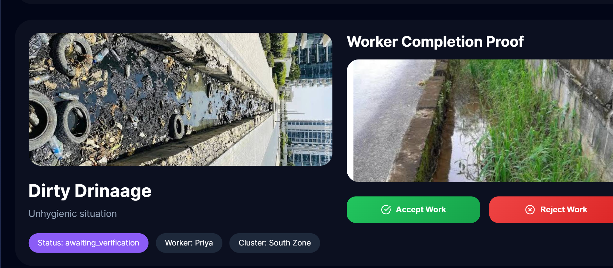
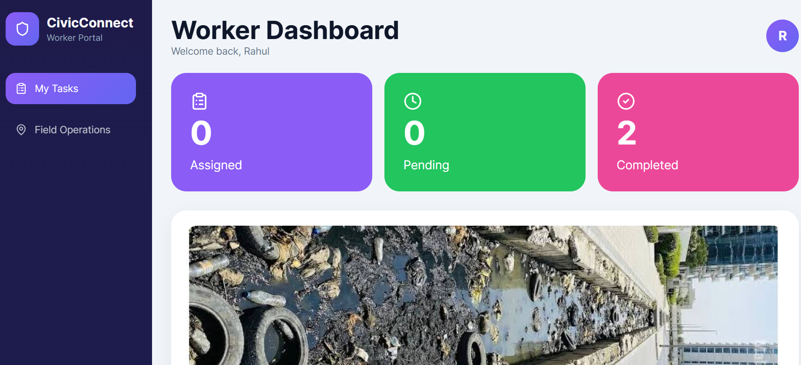
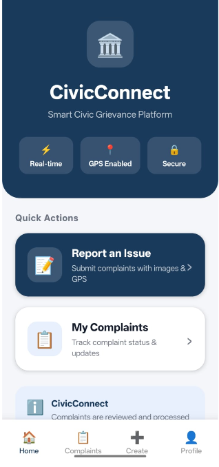
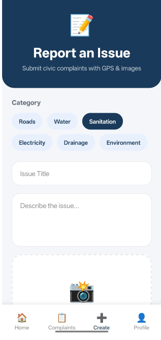
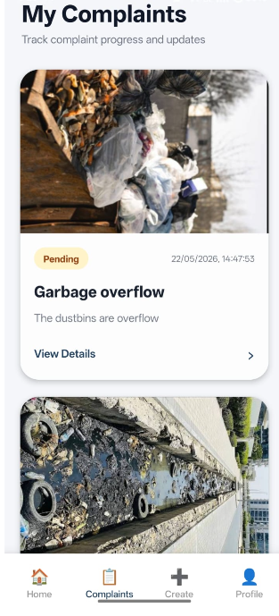

# CivicConnect 🚀

CivicConnect is an AI-powered smart city grievance management platform designed to improve communication between citizens, municipal administrators, and field workers.

The platform allows citizens to report civic issues such as garbage overflow, potholes, water leakage, electricity issues, and road damage through a mobile app. These complaints are automatically managed through an intelligent workflow involving admin dashboards and worker portals.

The system provides:
- Real-time complaint tracking
- Worker assignment
- Complaint status monitoring
- Completion proof upload
- Admin verification system
- Cluster-based smart city management

---

# 🌍 Problem Statement

Cities often struggle with:
- Delayed complaint resolution
- Lack of transparency
- Manual workforce coordination
- Poor citizen communication
- Inefficient complaint tracking

Citizens do not know:
- Whether their complaint was assigned
- Who is working on it
- Whether work is completed properly

Municipal departments face:
- Poor complaint management
- Lack of centralized systems
- Difficulty tracking workers
- No proper verification workflows

CivicConnect solves these problems through a centralized AI-enabled platform.

---

# 💡 Solution

CivicConnect creates a complete digital civic workflow:

Citizen Complaint
↓
Admin Dashboard
↓
Automatic / Manual Worker Assignment
↓
Worker Portal
↓
Worker Starts Work
↓
Worker Uploads Completion Proof
↓
Admin Verification
↓
Complaint Closed

The platform ensures transparency, accountability, and faster issue resolution.

---

# ✨ Features

## 👤 Citizen Mobile App
- Raise civic complaints
- Upload complaint images
- Add complaint description
- Location-based complaint creation
- Track complaint status
- Realtime updates

---

## 🛠 Worker Portal
- Login using phone number and password
- View assigned complaints
- Start work on complaints
- View complaint details and images
- Upload completion proof images
- Realtime complaint updates

---

## 🧑‍💼 Admin Dashboard
- View all complaints
- Track complaint status
- Monitor pending/in-progress/completed tasks
- Assign workers manually
- Smart worker assignment system
- Verify worker completion proof
- Accept or reject completed work
- View city cluster map
- Monitor worker activity

---

## 🤖 AI Features
- Smart complaint workflow
- Cluster-based assignment logic
- Future-ready AI automation architecture
- Intelligent civic management system

---

# 🧠 Workflow

## Step 1 – Citizen Raises Complaint
Citizen uploads:
- Complaint image
- Description
- Location details

Complaint is stored in Supabase database.

---

## Step 2 – Admin Dashboard
Admin can:
- View complaint
- Assign workers
- Monitor progress
- Track complaint lifecycle

---

## Step 3 – Worker Portal
Worker logs in using:
- Mobile number
- Password

Worker can:
- View assigned work
- Start work
- Upload proof after completion

---

## Step 4 – Verification
Admin verifies:
- Uploaded completion image
- Complaint resolution quality

Admin can:
- Accept work
- Reject work
- Reassign complaint

---

# 🏗 Architecture

## System Architecture

Citizen App
↓
Supabase Backend
↓
Admin Dashboard
↓
Worker Portal
↓
Verification System

---

# 🧰 Tech Stack

## Frontend
- React.js
- TypeScript
- Vite
- CSS
- Lucide React Icons

---

## Backend / Database
- Supabase
- PostgreSQL
- Supabase Storage
- Realtime Database

---

## Authentication
- Worker phone/password login
- Role-based workflow

---

## Storage
- Complaint image uploads
- Worker completion proof uploads

---

# 📸 Screenshots

## 🧑‍💼 Admin Dashboard

The Admin Dashboard provides complete control over the civic grievance workflow.

Features:
- Monitor all complaints in realtime
- Track complaint status
- Verify worker completion uploads
- Manage workers and clusters
- View live complaint zones on map



---

## 👷 Worker Portal

The Worker Portal is designed for field workers to manage assigned civic tasks.

Workers can:
- View assigned complaints
- Start work on complaints
- Upload completion proof images
- Track task progress
- Update complaint status



---

## 📱 Citizen Mobile App – Home Screen

The citizen mobile application allows users to quickly access civic services.

Features:
- Report civic issues
- Access complaint system
- Navigate using bottom tabs
- Realtime civic reporting



---

## 📱 Citizen Complaint Management

Citizens can monitor submitted complaints and view updates.

Features:
- View complaint cards
- Track complaint progress
- Monitor status updates
- View uploaded complaint images



---

## 📱 Citizen Complaint Workflow

The mobile app provides a complete complaint lifecycle experience.

Features:
- Complaint tracking
- Realtime workflow updates
- Complaint status visibility
- Smart civic issue management



# 🗂 Project Structure

```bash
CivicConnect/
│
├── admin-dashboard/
├── worker-portal/
├── mobile-app/
├── README.md
└── .gitignore
